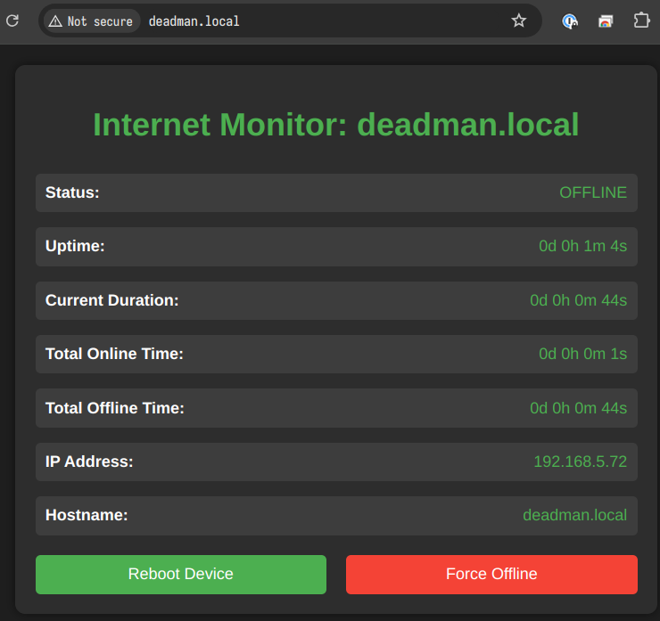
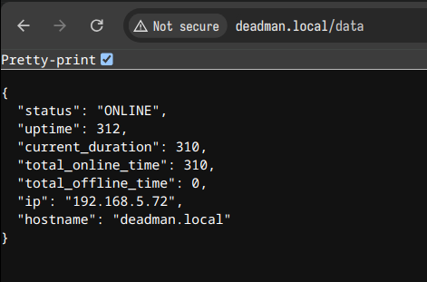

# Deadman's Internet

  

### A project by Matthew Rogers

Welcome to the **Deadman's Internet** project! My name is Matthew Rogers, and I'm passionate about creating practical, cost-effective solutions that solve real-world problems. You can learn more about my work on my [homepage](https://matthewrogers.org) or check out my other projects on my [GitHub profile](https://github.com/RamboRogers).

### Introduction

**Deadman's Internet** is a self-healing internet switch designed to ensure continuous connectivity by automatically resetting your network devices when a connection failure is detected. This project is ideal for anyone who experiences unreliable internet connections and wants a hands-off solution that keeps their network running smoothly without manual intervention.

The project is built around the affordable and powerful M5Stack AtomS3, making it both effective and budget-friendly, with a total cost of under $35.
| Online | Pinging | Cycling | Offline |
| --- | --- | --- | --- |
|  |  |  |  |

The Enclosure is a 3D printed relay box. I designed it in Fusion 360, and printed it on my Bambu P1S.

### Features

- **Automatic Internet Recovery**: Monitors your network and automatically resets the connection if a failure is detected.
- **Real-Time Status Display**: Includes a built-in display that shows the current network status, uptime, and IP address.
- **Self-Reliant**: Functions independently, ensuring your internet connection recovers even when you're not present.
- **Web Interface**: Access the device's status and controls via a user-friendly web interface.
- **JSON API**: Retrieve detailed status information in JSON format via the `/data` endpoint.
- **Remote Reboot**: Ability to reboot the device remotely via the web interface.
- **Force Offline**: Option to force the device offline for testing or maintenance purposes.
- **Auto-Reboot**: The device will automatically reboot after 60 minutes of continuous internet issues.
- **Cost-Effective**: The entire project can be built for less than $35, using easily obtainable components.
- **Customizable**: The code is open-source and easily modifiable to suit different network environments or requirements.

### Hardware

To build the **Deadman's Internet** project, you will need the following hardware:

- [M5Stack AtomS3](https://shop.m5stack.com/products/atoms3-dev-kit-w-0-85-inch-screen): The core microcontroller that drives the project.
- [4-Relay Module](https://www.elegoo.com/products/elegoo-8-channel-relay-module-kit?variant=32467576356912): Allows the device to control power to your network equipment.
- [3D Printed Enclosure](PrintReady-RelayBoxv6.3mf): Protects the hardware and provides a neat, professional finish.
- [M3 Bolts](https://www.amazon.com/Metric-Screws-Suitable-Printer-Assortment/dp/B0B51BFSWZ/): Used to assemble the enclosure.
- [Male to Female Dupont Wires](https://www.amazon.com/California-JOS-Breadboard-Optional-Multicolored/dp/B0BRTHR2RL/): For connecting the components together.

**Total Cost**: Less than $35

### Setup and Installation

1. **Assemble the Hardware**: Connect the M5Stack AtomS3 to the 4-relay module according to the provided wiring diagram. Secure everything in the 3D printed enclosure using the M3 bolts. Wiring wise you'll connect the 4-relay module to the AtomS3 like so in the picture below. G5 and G6 are connected to the IN1 and IN2 of the relay module. You can use any GPIO pins you'd like, just make sure to change the code accordingly. The enclosure is sized perfectly with the M5Stack AtomS3 and the 4-relay module so the AtomS3 will snap right into it without any modifications or need to glue it in.

2. **Upload the Code**: Clone the repository and upload the provided code to the AtomS3 using PlatformIO. Ensure you have the necessary libraries installed. Make sure to put your wifi credentials into the code.

3. **Configure Your Network**: Modify the code to include your Wi-Fi credentials and any other specific settings for your network environment.

4. **Deploy**: Once everything is configured and the code is running, the **Deadman's Internet** device will begin monitoring your connection and automatically reset it as needed. Just plug in your router and ONT and plug the device into power. Right now it pings 8.8.8.8, but you can change that to any IP address you'd like.

### Web Interface and JSON API

**Deadman's Internet** provides a user-friendly web interface for monitoring and controlling the device:

- **Web Interface**: Access the current status and controls by navigating to the device's IP address in your web browser.
- **JSON API**: For more detailed status information, access the JSON API available at `/data`. This API provides data such as connection status, uptime, and the device's IP address in a structured format suitable for integration with other systems.

**Web GUI**

**JSON API**

### Usage

Once deployed, **Deadman's Internet** will monitor your network connection continuously. If it detects that the connection is lost, it will automatically reset the connected devices by toggling the relay module. The status of the connection and the uptime will be displayed on the AtomS3's screen and the web interface.

You can use the web interface to:
- View real-time status information
- Reboot the device remotely
- Force the device offline for testing or maintenance

### Recent Updates 2024-10-06

- Switched from Arduino IDE to PlatformIO for improved development workflow and dependency management.
- Added a remote reboot feature accessible via the web interface.
- Implemented a "Force Offline" function for testing and maintenance purposes.
- Added an auto-reboot feature that triggers after 60 minutes of continuous internet issues.
- Updated the web interface with new controls for reboot and force offline functions.
- Updated the endpoint to /data instead of /api and moved to seconds as a unit of measurement to allow easier charting.
- Add mDNS to the project to allow easier discovery.

### Recent Updates 2024-10-06
 
 - Discovered that the wifi was not reconnecting properly so added reconnect functionality.

### Future Enhancements

- **Customization**: The project is open-source, and contributions are welcome! Feel free to fork the repository and add your improvements.

### Contributing

If you have any ideas for enhancing the project or find any issues, feel free to open an issue or submit a pull request on the [GitHub repository](https://github.com/RamboRogers/Deadmans-Internet).

### License

This project is licensed under the MIT License - see the LICENSE file for details.

---

Thank you for your interest in the Deadman's Internet project. We're constantly working to improve and expand its capabilities. Stay tuned for more updates!